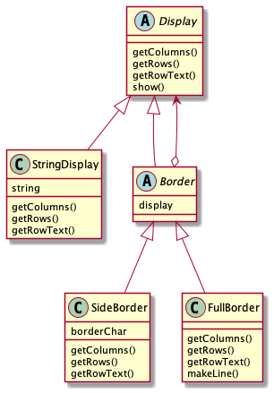

# `Decorator`パターン

# 概要

- `Decorator`パターンとは, 中心となるものに飾り付けとなる機能を一皮一皮被せていき, より目的に合ったオブジェクトに仕上げていくパターンのことである.
  > decorator: 飾り付けするもの

# サンプルプログラム

サンプルプログラムは, 文字列の周りに飾り枠をつけて表示するというものである. ここでいう飾り枠とは, `-`, `+`, `|`という文字で描いたもののこととする.

クラス一覧は以下に示す通りである.
| クラス名 | 解説 |
| --- | --- |
| Display | 文字列表示用の抽象クラス |
| StringDisplay | 1 行だけからなる文字列表示用のクラス |
| Border | 「飾り枠」を表す抽象クラス |
| SideBorder | 左右にのみ飾り枠をつけるクラス |
| FullBorder | 上下左右に飾り枠をつけるクラス |
| Main | 動作テスト用のクラス |

なお, クラス図は以下に示す通りである.



## 備考

- `Display`クラスは, 複数行からなる文字列を表示するための抽象クラスである
  - `getColumns`と`getRows`は, それぞれ横の文字数と縦の行数を得るためのメソッドである
  - `getRowText`は指定した行の文字列を得るためのメソッドである
    - この 3 つのメソッドは実装はサブクラスで行われる(抽象クラスであるため)
  - `show`は全ての行を表示するメソッドである
    - `getRows`メソッドで行数を取得し, `getRowText`で表示すべき文字列を取得
    - その後, for ループを使って全ての行を表示している
    - `show`は`getRows`と`getRowsText`を使った`Template Method`パターンとなっている(→ 第 3 章)
- `StringDisplay`クラスは`Display`クラスのサブクラスであり, 1 行の文字列を表示するクラスである
  - `Display`クラスで宣言されたメソッドの実装はこちらで行われる
  - `string`フィールドは文字列を保持する
  - このクラスで表示するのは`string`フィールドの内容 1 行だけであるため, `getColumns`は`string.getBytes().length`の値を返し, `getRows`は 1 を返す
- `Border`クラスは「飾り枠」を表す抽象クラスである
  - 文字列表示をする`Display`のサブクラスとして定義
  - つまり, 継承によって**飾り枠は中身と同じメソッドを持つ**ことになる
    - 具体的に言えば, `Border`クラスでも`Display`クラスで宣言されたメソッドを継承している
    - インターフェース(API)的に見れば, 飾り枠と中身を同一視できるということを意味する
  - `Border`クラスは, `Display`型の`display`フィールドを持つ
    - これは, この飾り枠が包んでいる「中身」を指すものである
    - しかし, `display`フィールドの中身が`StringDisplay`のインスタンスであるとは限らない
      - `Border`も`Display`クラスのサブクラスであり, 抽象クラスであるため, `Border`のサブクラスが入る可能性も...??
- `SideBorder`クラスは, `Border`クラスのサブクラスであり, 文字列の左右に決まった文字(`borderChar`)で飾りをつけて, `show`で表示する
  - 飾り付けの文字は指定できる
  - `borderChar`フィールドはコンストラクタで指定
  - `SideBorder`クラスはスーパークラスで宣言されていた抽象メソッドが全てここで実装されているため, 抽象クラスではない
  - `getColumns`は, 表示文字の横の文字数を得るメソッドであり, 文字数は「中身」の文字数+左右の飾り文字分(1+1)で計算される
    - 「中身」の文字数は`display.getColumns()`で得られる
    - `display`フィールドが`Border`クラスで`protected`であるため, サブクラスで直接利用できる
    - `getRows`についても同様に考えることができる
  - `getRowText`メソッドは, 引数で指定した行の文字列を得るものである
    - そのため, `borderChar + display.getRowText(row) + borderChar`で求めることができる
- `FullBorder`クラスも`SidebarBorder`クラスと同様, `Border`のサブクラスである
  - 飾り付けの文字は固定である
  - `makeLine`メソッドは, 指定した文字を連続させた文字列を作る, 補助用のメソッドである
    - クラス外からは使えないように`private`にしている
- `Main`クラスは動作テスト用のクラスである
  - ここで使われているインスタンス b1〜b4 の役割は以下に示す通りである
    - b1:"Hello World"を飾りなしで表示する
    - b2:b1 に対して, '#'の文字で左右に飾り付けをしたもの
    - b3:b2 に対して全体の飾り枠をつけたもの
    - b4:"こんにちは。"に何重にも飾り枠をつけたもの

# 登場人物

- `Component`の役
  - 機能を追加するときの核になる役. 飾り付けされる中心となるもののインターフェース(API)だけを定める
  - サンプルプログラムでは, `Display`クラスがこの役を務めた
- `ConcreteComponent`の役
  - `Component`役のインターフェース(API)を実装している具体的な部分
  - サンプルプログラムでは, `StringDisplay`クラスがこの役を務めた
- `Decorator`(装飾者)の役
  - `Component`役と同じインターフェース(API)を持つ
  - さらに, `Decorator`役が対象となる`Component`役を持っている
  - この役は, 自分が飾っている対象を「知っている」
  - サンプルプログラムでは, `Border`クラスがこの役を務めた
- `ConcreteDecorator`(具体的な装飾者)の役
  - 具体的な`Decorator`の役
  - サンプルプログラムでは, `SidebarBorder`クラスと`FullBorder`クラスがこの役を務めた

# パターンを使う意義

## 透過的なインターフェース(API)

- `Decorator`パターンでは, 飾り枠と中身を同一視している.
  - サンプルプログラムでは, 飾り枠を表す`Border`クラスが, 中身を表す`Display`クラスのサブクラスになっているところで, その同一視が表現されている.
  - `Border`クラス(及びそのサブクラスたち)は中身を表す`Display`クラスと同じインターフェース(API)を持っている
  - 飾り枠を使って中身を包んでも, インターフェース(API)は少しも隠されない
    - `getColumns`, `getRows`, `getRowText`, `show`メソッドは隠されることなく他のクラスから見ることができる
    - これをインターフェース(API)が **「透過的」**であるという
  - サンプルプログラムのインスタンス`b4`のように, 飾り枠をたくさん使って包んでも インターフェースは全く変更されていない
- インターフェース(API)が透過的であるため, `Decorator`パターンでは, `Composite`パターンに似た再帰的構造が登場する
  - すなわち, 飾り枠が保持している「中身」が, 実際には別のものの「飾り枠」になっているという構造である
    - タマネギの皮をむいたら, 中身も皮だったというイメージ
- `Decorator`パターンと`Composite`パターンは, 再帰的な構造を扱うという点では似ているが, 目的はかなり異なる
  - `Decorator`パターンは外枠を重ねることで機能を追加していく点に主眼を置いている
  - `Composite`パターンは容器(`Composite`役)と中身(`Leaf`役)を`Component`役として同一視し, 再帰的な構造を作成することに主眼を置いている

## 中身を変えずに, 機能追加ができる

- `Decorator`パターンでは, 飾り枠も中身も共通のインターフェース(API)を持っている

## 動的な機能追加ができる

-

## 単純な品揃えでも, 多様な機能追加ができる

-

## java.io パッケージと Decorator パッケージ

-

## 小さいクラスが増えてしまう

-

# 関連しているパターン

- Adapter パターン(第 2 章)
- Strategy パターン(第 10 章)

# 補講：継承と委譲における同一視

ここでは, 「同一視」すなわち「同じものとみなす」ということについて少し考える.

## 継承〜サブクラスとスーパークラスを同一視〜

サブクラスは, スーパークラスと同一視することができる. 以下に簡単な例を示す.

```java
class Parent {
    ...
    void parentMethod() {
        ...
    }
}
```

```java
class Child extends Parent {
    ...
    void chileMethod() {
        ...
    }
}
```

このとき, `Child`のインスタンスは, `Parent`型の変数にそのまま代入することができる. そして, `Parent`から継承しているメソッドをそのまま呼び出すことができる.

```java
Parent obj = new Child();
obj.parentMethod();
```

つまり, `Child`のインスタンスをあたかも`Parent`のインスタンスであるかのように扱っている. これは, サブクラスをスーパークラスだとみなしている例である. ちなみに, 上の例とは逆に, スーパークラスをサブクラスだとみなすためには, キャストが必要である.

```java
Parent obj = new Child();
((Child)obj).childMethod();
```

...`Border`クラスのこと??← よく確認してみる必要あり

## 委譲〜自分と委譲先を同一視〜

委譲を使ってインターフェースが透過的になっているときには, 自分と委譲先を同一視することができる. まず, ぎこちない例を示す.

```java
class Rose {
    Violet obj = ...
    void method() {
        obj.method();
    }
}
```

```java
class Violet {
    void method() {
        ...
    }
}
```

`Rose`と`Violet`は同じ`method`を持っていて, `Rose`は`Violet`に委譲している. しかし, この例では両者とも共通のメソッドである`method`を持っているのだが, 「共通である」という情報が明示されていないため, 少々違和感がある.

それを踏まえて, 共通の抽象クラス`Flower`を作成した例を示す.

```java
abstract class Flower {
    abstract void method();
}
```

```java
class Rose extends Flower{
    Violet obj = ...
    void method() {
        obj.method();
    }
}
```

```java
class Violet extends Flower{
    void method() {
        ...
    }
}
```

`Flower`をインターフェースとしても良い.

```java
interface Flower {
    abstract void method();
}
```

```java
class Rose implements Flower{
    Violet obj = ...
    void method() {
        obj.method();
    }
}
```

```java
class Violet implements Flower{
    void method() {
        ...
    }
}
```

ここまで考えてくると, `Rose`の中のフィールド`obj`は`Violet`型, と特化してしまっていいのか？という疑問や, もしかしたら, より広い`Flower`型の方が良いのではないか？という疑問も生じる. どうするべきかは実際のプログラムによって変わってくる
